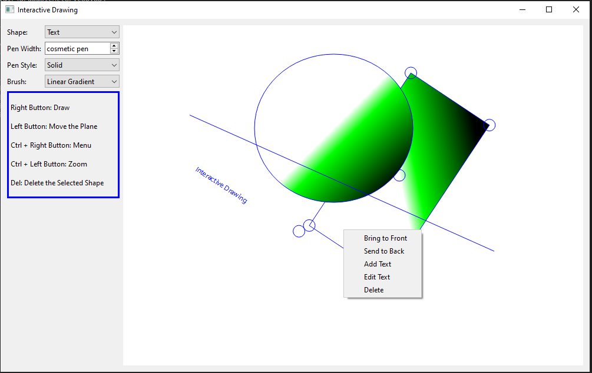

# InteractiveDrawing
Draw interactive shapes in Qt

## Main Elements:

`Window` constructs the UI.

`RenderArea` is the main widget of the application.

`DrawablesScene` class handles user interactions that are received from `RenderArea`.

`Drawables.h/.cpp` contains all of the classes that are related to the interactive shapes.

`MovableActor` handles the requests to the shapes collection.

`TextActor` manages text elements.

`SceneMapper` maps between coordinate systems.

## Sample:

